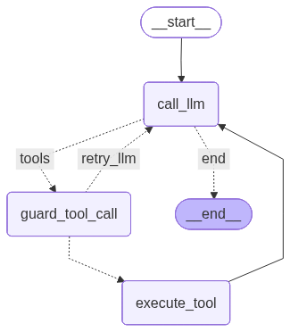

# Notes-Agent



A conversational note-taking AI agent that lets users manage personal notes entirely through natural language. Built with Python, LangGraph, SQLite, and ChromaDB.

## Features

### Core Capabilities
- **Add Notes**: Create new notes with titles, bodies, and tags via natural language.
- **List & Search Semantic Notes**: Retrieve notes by keyword, tags, date, or utilizing powerful **Semantic Similarity Search** (vector embeddings via ChromaDB).
- **Modify & Delete Notes**: Update existing note content/tags, or delete notes by reference.
- **Answer Questions**: Summarize, compare, and reason over your existing notes.

### Required Behaviors Implemented
- **Intent Disambiguation**: Asks for clarification when a user's request could match multiple notes.
- **Confirmation on Destructive Actions**: Explicit safety confirmations for deleting or significantly updating notes.
- **Multi-turn Awareness**: Handles follow-up conversational messages referring to previous steps (e.g., "Actually, change the tag to vegan too").
- **Graceful Error Handling**: Communicates search failures and tool exceptions clearly.
- **Multi-user Isolation**: Operations enforce user scoping by binding `user_id` to database and vector queries.

## Setup Instructions

### 1. Dependencies

Ensure you have Python installed, then install the required dependencies using `pip`:

```bash
pip install -r requirements.txt
```

### 2. Environment Variables

Create a `.env` file in the root directory with the following variables based on your preferred LLM provider:

```env
# Choose an LLM Provider ("groq", "gemini", or "openrouter")
LLM_PROVIDER=openrouter
# Default Model to use
LLM_MODEL=qwen/qwen3.5-flash-02-23

# API Keys (Set the one corresponding to your provider)
GROQ_API_KEY=your_groq_api_key_here
GEMINI_API_KEY=your_gemini_api_key_here
OPENROUTER_API_KEY=your_openrouter_api_key_here

# Database Configuration (Optional - Defaults are provided)
DATABASE_URL=sqlite:///./notes.db
CHROMA_URL=./chroma_data
```

*(Note: When running via Docker Compose, `DATABASE_URL` and `CHROMA_URL` are automatically overridden to save into a local `./data` folder so your notes survive restarts).*

### 3. How to Run

#### Run with Docker

You can run the entire solution with a single command using Docker Compose. This builds the image and drops you into the interactive terminal, with your data securely persisted to the local `./data` folder.

```bash
docker-compose run --rm notes-agent
```

#### Run Locally (Without Docker)

Start the interactive conversational agent in your local terminal:

```bash
python -m src.main
```

#### Run As An MCP Server

This project includes a minimal MCP server over stdio that exposes the note operations as MCP tools. Start the MCP server using:

```bash
python -m src.mcp_server
```

## Documentation

- **Tool Schema Documentation**: See [docs/tool_schema.md](docs/tool_schema.md) for a clear description of each tool/function the agent can call, its parameters, and return types.

## Evaluation Harness

This project contains a comprehensive evaluation harness simulating 15 conversational scenarios to test the agent's intent interpretation, tool execution, safety compliance, and follow-up conversational awareness. The evaluation measures how well the LangGraph setup picks the right tools (or forbids them for destructive actions without explicit user ID confirmation).

To run the automated test suite locally and view pass/fail metrics, execute:

```bash
python -m tests.evaluate
```

This will run the scenarios sequentially against an isolated `test_evaluator` user.
Most runs gave 100% (15/15 passed) and 93.3% (14/15 passed).

## Bonus Features Implemented

- **Semantic Search:** Embeds notes using a vector embedding model (via ChromaDB) avoiding brittle exact-keyword limits.
- **MCP Server implementation:** Exposes the underlying note CRUD operations over the Model Context Protocol (MCP) using standard stdio streams, accessible to any MCP-compatible conversational client.
- **Multi-user isolation:** Enforces isolation at the database (relational) and vector store (Chroma) level strictly via `user_id`.

### Notes On Scope

- `user_id` is required on every backend/MCP tool call for multi-user isolation.
- Conversational confirmations and disambiguation are handled by the LangGraph chat agent path.